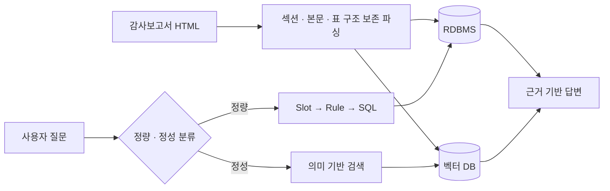

# AuditQA: 삼성전자 감사보고서 RAG QA 시스템

> 감사보고서의 표 수치는 SQL로 정확하게 조회하고, 설명형 본문은 의미 기반으로 검색하는 금융 문서 질의응답 시스템입니다.

- 형태: 서울대학교 빅데이터 핀테크 AI 고급 전문가 과정 팀 프로젝트
- 역할: 파싱 파트 리더
- 담당 범위: 복잡한 감사보고서 파싱 방법론 제안·구현, 연도별 데이터 정리, SQL 조회 실험, 프로젝트 문서화
- 기술: Python, BeautifulSoup, MariaDB, DuckDB, Qdrant, Hugging Face Transformers, PEFT, RAG
- 원본 저장소: [Samsung-Financial-Reports-NLP](https://github.com/SNU-Bigdata-Fintech-AI-11th-Team6/Samsung-Financial-Reports-NLP)

## 문제와 목표

감사보고서는 설명형 본문과 복잡한 재무표가 한 문서에 함께 존재합니다. 벡터 DB만 사용하면 정확한 수치 조회와 연도별 계산이 어렵고, SQL만 사용하면 감사의견이나 회계정책처럼 의미를 해석해야 하는 질문에 대응하기 어렵습니다.

팀은 질문을 정량·정성 유형으로 분류하고 데이터의 성격에 따라 검색 경로를 나누는 하이브리드 검색 구조를 설계했습니다.

## 시스템 흐름

## 직접 기여

### 복잡한 감사보고서 파싱 방법론 제안·구현

파싱 파트 리더로서 감사보고서 HTML의 섹션 계층을 유지하면서 본문과 표를 분리하는 방법을 제안하고, 섹션 구조 파싱 코드를 구현했습니다. 파싱 결과에는 연도·섹션 정보와 원문 메타데이터를 남겨 후속 SQL·벡터 검색에서 출처를 추적할 수 있도록 했으며, 2014년부터 2024년까지의 문서를 연도별 JSON 산출물로 정리했습니다. `rowspan`·`colspan` 해제와 다중 헤더 평탄화는 팀의 표 처리 파이프라인에 포함된 기능입니다.

### SQL 조회 실험

연도·섹션·행·열·연산 옵션으로 구성된 질문 슬롯을 SQL 조회로 연결하는 실험 코드를 작성하고 결과를 점검했습니다. 이 작업은 팀의 `Slot → Rule → SQL` 질의 경로를 검증하는 기반으로 사용됐습니다.

### 프로젝트 구조 문서화

데이터 처리 단계와 디렉터리별 역할, DB 설계 전략을 문서화해 팀원이 전체 파이프라인과 산출물의 위치를 추적할 수 있도록 했습니다.

## 핵심 기술 결정

아래는 팀 전체가 채택한 검색 설계이며, 제 직접 담당 범위는 파싱 파트 리딩과 복잡한 감사보고서 파싱 방법론 제안·구현, 연도별 데이터 정리, SQL 조회 실험과 프로젝트 문서화입니다.

팀은 `RDBMS + 벡터 DB` 구조를 선택해 수치 계산의 정확성과 본문 의미 검색을 분리했습니다. 또한 `Slot → Rule → SQL` 흐름으로 자연어 입력과 데이터 조회 사이에 검증 가능한 중간 표현을 두고, LLM이 SQL을 직접 생성할 때 생기는 변동성을 줄였습니다.

## 결과와 검증

- 삼성전자 2014–2023년 감사보고서를 기준 범위로 삼아 정형·비정형 검색 파이프라인을 구성했습니다.
- 정량 질문은 슬롯 기반 SQL로, 정성 질문은 Qdrant 의미 검색으로 처리했습니다.
- 팀의 LoRA 슬롯 파서는 검증 481건에서 JSON 파싱 성공률 100%, 전체 객체 Exact Match 67.98%, 질문 유형 정확도 99.79%를 기록했습니다.
- HTML 파싱부터 데이터 적재, 검색, LLM 답변 생성과 LoRA 파인튜닝까지 이어지는 end-to-end 프로토타입을 구현했습니다.

위 LoRA 평가 수치는 팀 전체 결과이며, 제 직접 담당 범위는 파싱 파트 리딩과 데이터 파싱, 정형 검색 기반에 집중되어 있습니다.

## 제약과 개선 방향

- 현재 평가는 슬롯 파서의 구조화 출력 성능에 집중되어 있어 검색 적합도와 최종 답변의 사실성을 포함한 end-to-end 평가가 추가로 필요합니다.
- 저장소의 일부 실험 코드와 환경별 설정은 정리가 필요해 완전한 재현에는 추가 작업이 필요합니다.
- 운영 단계에서는 파싱 결과와 원문 위치, SQL·벡터 검색 결과와 최종 답변을 연결하는 데이터 계보를 검증 지표와 함께 관리해야 합니다.

## 관련 자료

- [DB 스키마 설계 문서](https://github.com/SNU-Bigdata-Fintech-AI-11th-Team6/Samsung-Financial-Reports-NLP/blob/main/doc/DB_Schema_Strategy.md)
- [프로젝트 구조 문서](https://github.com/SNU-Bigdata-Fintech-AI-11th-Team6/Samsung-Financial-Reports-NLP/blob/main/doc/project_structure.md)
- [감사보고서 파싱 코드](https://github.com/SNU-Bigdata-Fintech-AI-11th-Team6/Samsung-Financial-Reports-NLP/tree/main/src/data_processing)
- [SQL 조회 실험](https://github.com/SNU-Bigdata-Fintech-AI-11th-Team6/Samsung-Financial-Reports-NLP/tree/main/src/data_generation)

[포트폴리오로 돌아가기](../README.md)
