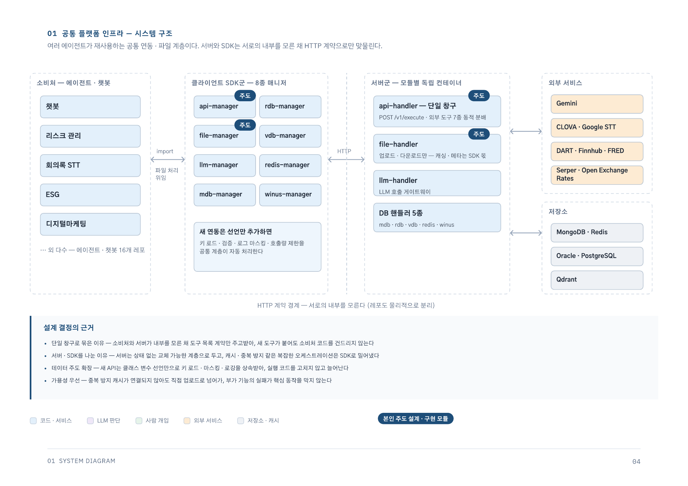
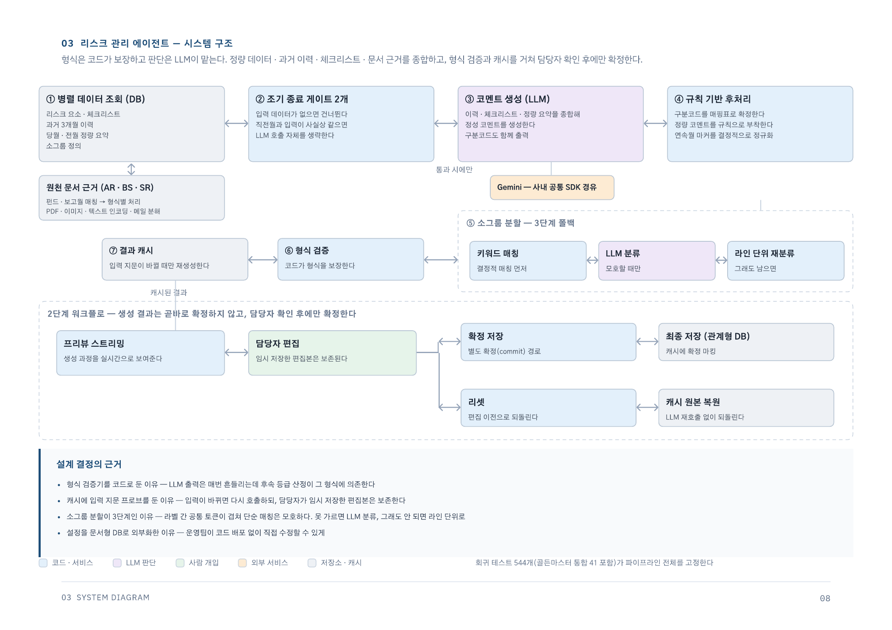
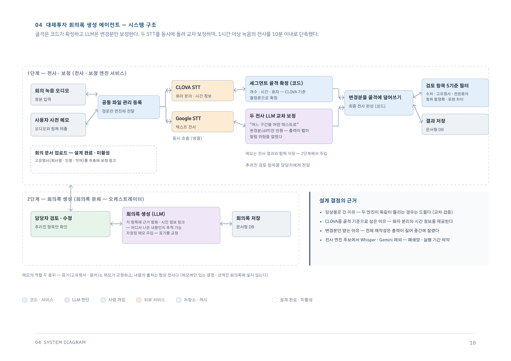
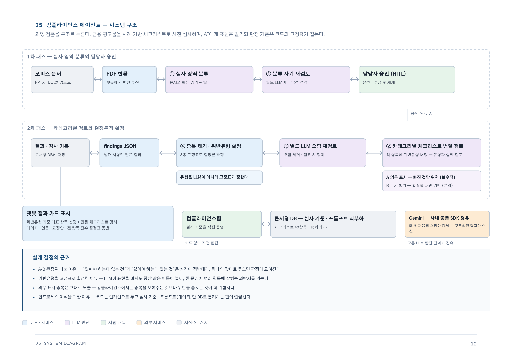
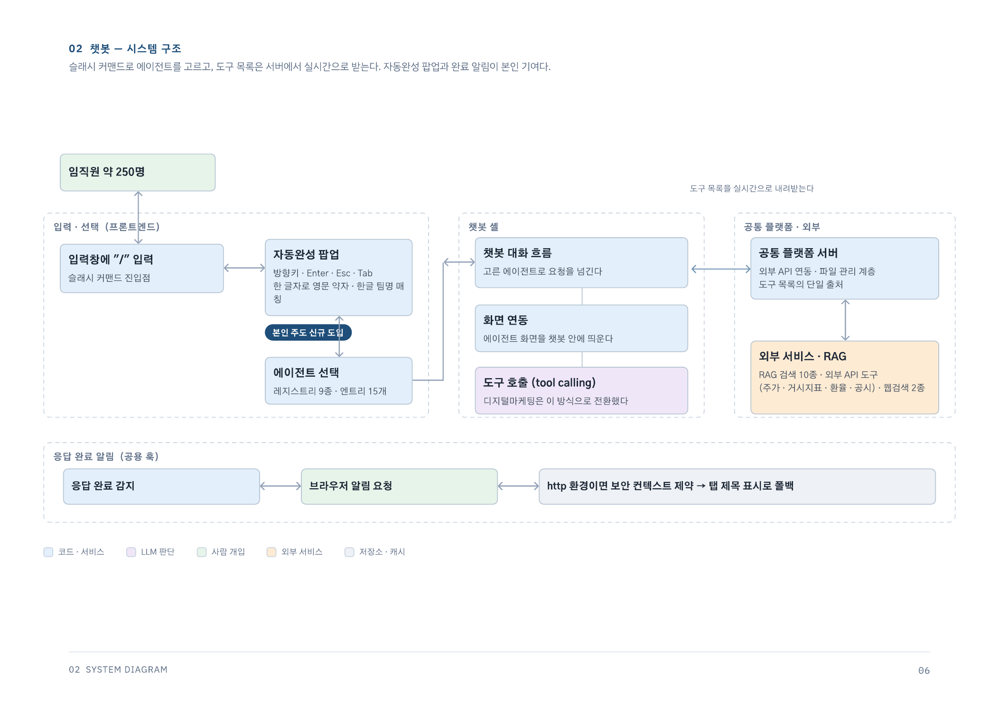
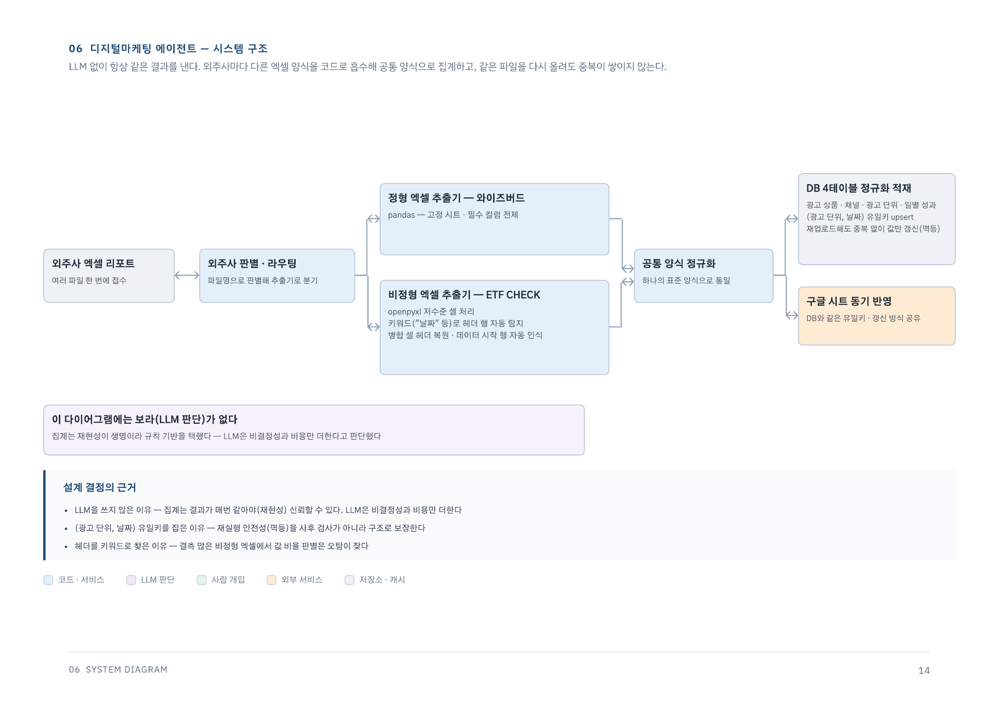
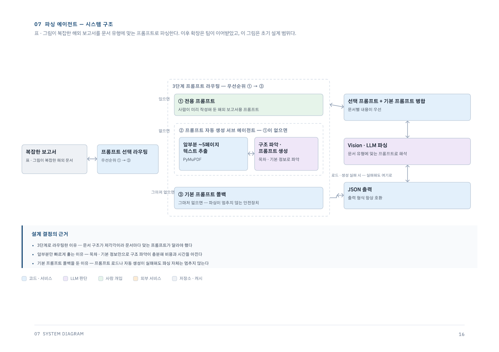
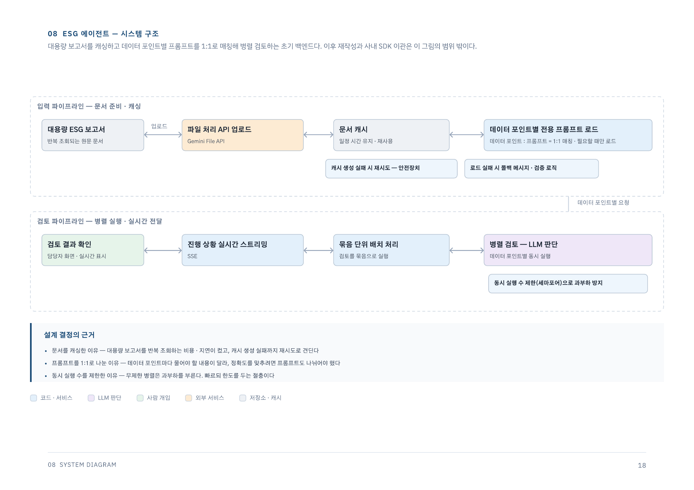
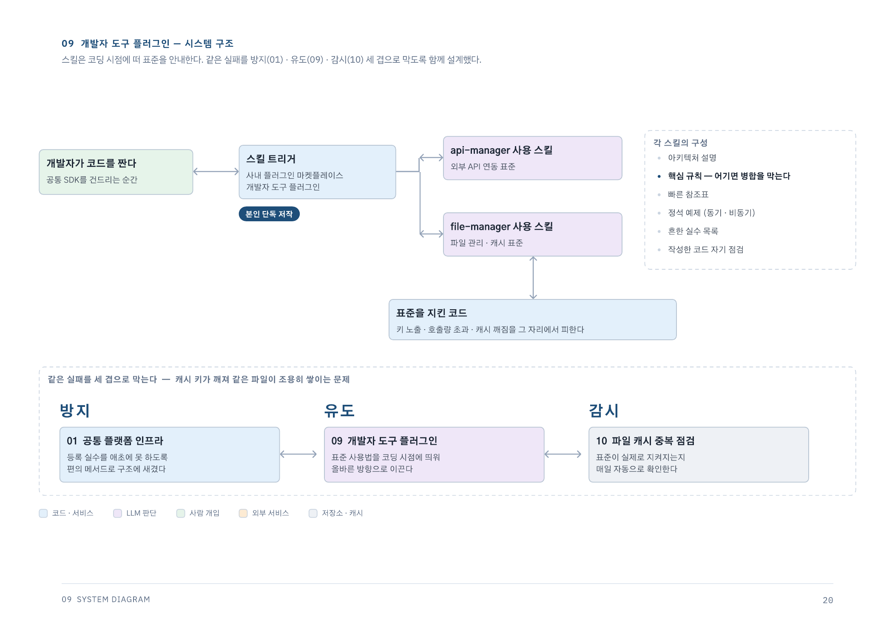
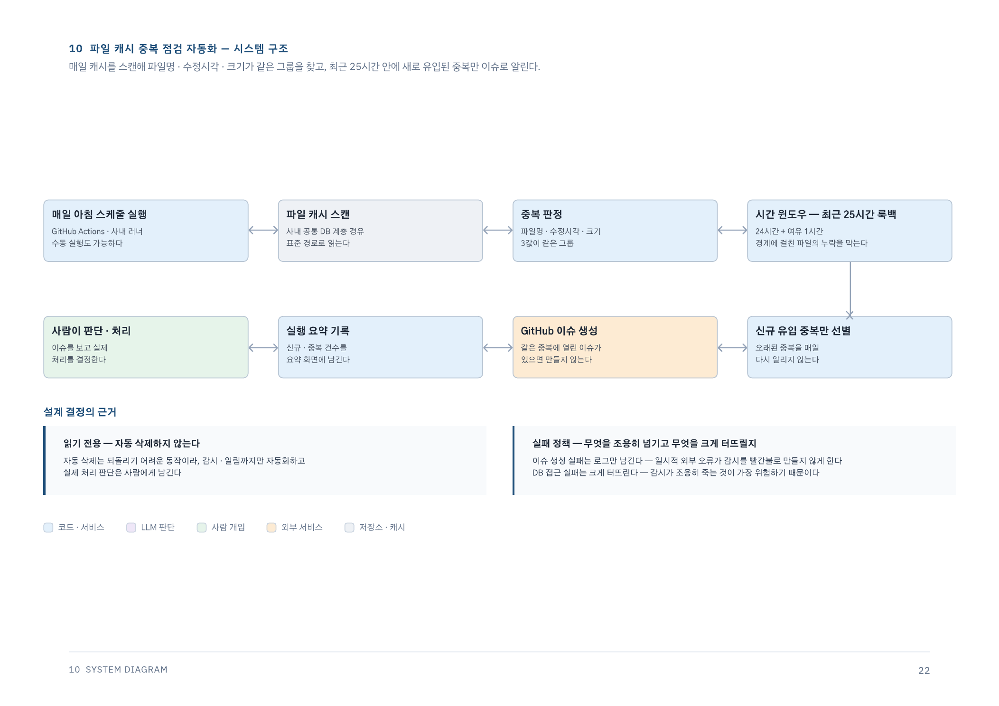

# 키움투자자산운용 AI 업무지원 플랫폼

> 캡스톤 프로젝트의 성과를 바탕으로 인턴 제안을 받고, 같은 사내 AI 플랫폼을 운영 가능한 구조로 발전시킨 경험입니다.

- 소속: 키움투자자산운용 혁신추진팀 연계 캡스톤 프로젝트 및 인턴십
- 캡스톤 프로젝트: 2025년 10월 29일–2026년 1월 22일
- 인턴십: 2026년 1월 29일–2026년 7월 31일
- 팀 성과: 캡스톤 우수 발표상 수상
- 개인 결과: 캡스톤 성과를 바탕으로 인턴 제안
- 형태: 여러 팀원이 함께 개발한 사내 비공개 프로젝트
- 담당 범위: 리스크 관리 AI, 음성 전사(STT) 서비스, 공통 API·파일 처리 인프라, 도메인 에이전트 개발과 통합
- 기술: Python, TypeScript, FastAPI, Pydantic, asyncio, SSE, React, LangGraph, MongoDB, Redis, Docker, Jenkins
- 원본 저장소: 비공개 사내 저장소

## 경험의 흐름

### 캡스톤 프로젝트 | 2025.10.29–2026.01.22

키움투자자산운용의 실제 업무를 주제로 투자 리스크 코멘트 생성과 ESG 문서 처리 등 사내 AI 업무지원 기능을 개발했습니다. 팀 프로젝트가 2026년 1월 22일 캡스톤 우수 발표상을 받았고, 저는 그 성과를 바탕으로 인턴 제안을 받았습니다.

### 인턴십 | 2026.01.29–2026.07.31

캡스톤에서 다룬 기능을 이어받아 리스크 관리 서비스를 고도화하고, 음성 전사와 LLM 보정, 공통 API·파일 처리 인프라, 컴플라이언스 등으로 담당 범위를 넓혔습니다. PoC를 실제로 반복 사용할 수 있도록 비동기 처리, 저장, 캐시, 오류 복구와 사용자 검증 흐름을 보강했습니다.

## 프로젝트 배경

투자자산운용사의 업무에는 정형 데이터 조회뿐 아니라 보고서, 운용 문서, 음성 기록처럼 형식이 다른 자료를 함께 처리해야 하는 과정이 많습니다. 팀은 이 업무들을 하나의 거대한 애플리케이션에 넣지 않고, 도메인별 AI 서비스와 공통 인프라로 나눠 개발했습니다.

저는 캡스톤 프로젝트에서 업무에 AI를 적용할 가능성을 검증한 뒤, 인턴십에서 비동기 실행, 데이터 저장, 캐시, 오류 복구, 공통 SDK와 사용자 검증 화면을 연결해 반복적으로 사용할 수 있는 서비스로 발전시키는 작업을 담당했습니다.

## 공개 가능한 서비스 구성

도메인 서비스는 업무별 판단과 생성 흐름을 담당하고, 파일·외부 API·저장과 오류 처리는 공통 계층으로 분리했습니다. 민감한 시스템 주소와 인증·연결 정보는 공개 범위에서 제외했습니다.

## 핵심 성과

- 리스크 코멘트 작성 업무를 수일에서 하루 이내로 단축했습니다.
- 1시간 이상 분량의 회의 녹음을 10분 이내에 전사할 수 있도록 자동화했습니다.
- 금융 광고 파일 1건을 3분 이내에 심사할 수 있는 파이프라인을 구현했습니다.
- 수일 걸리던 디지털마케팅 데이터 적재 작업을 파일 1건당 30초 이내로 단축했습니다.
- 공통 파일 관리 기능을 여러 사내 서비스가 함께 사용하도록 표준화했습니다.

## 직접 기여

### 투자 리스크 코멘트 서비스

- 여러 펀드의 정량 데이터·과거 이력·원천 문서 근거 조회부터 코멘트 생성, 형식 검증, 사용자 편집 내용 병합과 최종 저장까지 전체 파이프라인을 설계·구현했습니다.
- 여러 부서와 펀드 단위 실행, 이전 결과 활용, 예외적인 펀드 구조와 하위 그룹 처리 로직을 보완했습니다.
- 다양한 형식의 보고서에서 근거를 추출해 생성 결과와 함께 확인할 수 있도록 연결했습니다.
- 문서별 근거 추출을 병렬화하고 캐시와 재생성 흐름을 정리했습니다.
- 단위·통합·회귀 테스트를 추가해 데이터 저장과 문서 근거 처리의 변경을 검증했습니다.
- 프롬프트와 분류 규칙을 문서형 DB로 분리해 운영 담당자가 코드 배포 없이 수정할 수 있게 했고, 수일 걸리던 작성 업무를 하루 이내로 단축했습니다.

### 대체투자 회의록 생성 및 STT·LLM 보정 서비스

- 1시간 이상의 회의 녹음을 전사하고 회의록으로 만드는 파이프라인을 설계하고, 전사·보정 서비스와 회의록 생성 서비스를 조정하는 오케스트레이터를 구현했습니다.
- 장시간 음성을 구간으로 나눠 병렬 전사하고, 서비스별 제한이나 오류가 발생하면 다른 경로로 처리하는 대체 처리 구조를 구성했습니다.
- 동기 요청으로 시작한 기능을 비동기 작업과 상태 조회 구조로 확장해 긴 작업이 웹 요청을 점유하지 않도록 했습니다.
- 세그먼트 개수·시간·화자는 코드로 확정하고 LLM에는 전사 결과 비교와 텍스트 보정만 맡겼습니다. 긴 출력이 잘리는 문제는 수정 구간만 반환받아 원본에 반영하는 방식으로 해결했습니다.
- 전사 결과 저장과 파일 관리 서비스 연동을 포함해 1시간 이상 분량의 회의 녹음을 10분 이내에 전사할 수 있도록 자동화했습니다.

### 공통 API·파일 처리 인프라

- 외부 API 연동과 파일 관리 기능을 처음부터 설계·구현하고, 독립 서비스와 Python SDK로 분리했습니다.
- 인증, 응답 검증, 로그 마스킹과 호출량 제한을 공통 계층으로 통합했습니다.
- 파일 메타데이터 추출, 업로드, 조회와 임시 파일 생성을 하나의 인터페이스로 통합했습니다.
- Redis 기반 잠금과 대기 흐름, 파일 캐시 중복 탐지, 재시도와 장애 시 대체 처리를 구현했습니다.
- 서비스마다 반복되던 등록·변환 코드를 SDK 내부로 옮기고 테스트를 통해 공통 계약을 검증했으며, 파일 관리 모듈을 여러 사내 저장소에서 공통으로 사용하도록 연결했습니다.

### 컴플라이언스 광고심사 에이전트

- 금융투자협회 심사 사례를 분석해 카테고리와 체크리스트로 구조화하고, 각 항목을 관련 규정과 위반 유형에 연결했습니다.
- 병렬 검토와 오탐 필터링을 포함한 다단계 파이프라인을 구성하고 현업 피드백을 반영해 의미 기반 판단 규칙을 보완했습니다.
- LLM 호출과 결정적 판단 로직을 분리하고 회귀 테스트를 적용했으며, 광고 파일 1건을 3분 이내에 심사할 수 있도록 자동화했습니다.

### 디지털마케팅 데이터 적재 자동화

- 외주사마다 형식이 다른 광고 리포트에서 헤더와 데이터 시작 위치를 찾아 공통 형식으로 변환하고 DB와 Google Sheets에 적재하는 파이프라인을 단독 설계·구현했습니다.
- 광고 데이터를 정규화하고 동일 파일을 다시 처리해도 중복 행이 생기지 않도록 적재 기준을 설계했습니다.
- 정형 집계 업무에는 LLM 대신 재현 가능한 규칙 기반 방식을 선택해 수일 걸리던 수작업을 파일 1건당 30초 이내로 단축했습니다.

### 문서 처리와 사내 챗봇 연동

- ESG 보고서 평가 파이프라인에 파일 기반 LLM 처리, 문맥 캐시(context caching), 재시도 로직과 검증 화면을 적용했습니다.
- 표와 이미지가 포함된 금융 문서를 Vision LLM으로 파싱하고, 문서 유형에 맞는 프롬프트를 생성하는 실험을 수행했습니다.
- 사내 챗봇의 에이전트 선택 UI와 키보드 탐색을 구현하고, 대화 중 모델이 필요한 기능을 선택하는 Tool Calling 방식으로 전환했습니다.
- 사내 규정 문서 검색 시스템의 하이브리드 검색 설계와 운영에 참여하고, 비교 평가를 통해 정확도를 유지하면서 호출 횟수와 응답 지연을 줄이는 방식을 채택했습니다.

## 구현 결과

직접 기여에서 설명한 기능들을 API, SDK, 웹 UI와 저장 계층이 연결된 서비스로 확장했습니다. 시간이 오래 걸리는 LLM·STT 작업에는 비동기 상태 조회를 적용하고, 생성 결과에는 문서 근거 검토 흐름을 연결했습니다. 공통 API·파일 관리 기능은 여러 사내 저장소가 함께 사용하는 패키지로 분리했으며, 캐시, 중복 방지, 분산 잠금, 재시도와 다중 서비스 대체 처리 구조로 반복 호출과 외부 서비스 장애에 대응했습니다.

정량 수치는 프로젝트 종료 시점에 정리한 업무 기록을 기준으로 공개 가능한 범위만 기재했습니다. 사내 원본 데이터와 측정 로그는 공개하지 않으며, 기술적 산출물은 비공개 저장소의 커밋 이력과 구현 코드로 교차 확인했습니다.

## 핵심 기술 결정

### 긴 작업을 비동기 작업으로 분리했습니다

문서 분석과 음성 전사는 처리 시간이 길고 외부 API 상태의 영향을 받습니다. 요청이 끝날 때까지 연결을 유지하는 대신 작업 생성, 상태 조회와 결과 저장을 분리해 실패 처리와 재시도를 명확하게 만들었습니다.

### 공통 기능을 서비스와 SDK로 분리했습니다

각 도메인 서비스가 파일 저장, 외부 API 호출과 데이터 연결을 직접 구현하면 계약이 달라지고 수정 범위가 커집니다. 공통 동작을 독립 서비스로 두고 소비자는 SDK를 사용하도록 해 호출 방식을 통일했습니다.

### 생성 결과에 검증 경로를 함께 제공했습니다

금융 업무에서 자연스러운 문장보다 근거 확인 가능성이 중요하다고 판단했습니다. 생성 결과를 바로 확정하지 않고 미리보기, 문서 근거 확인과 저장 단계를 분리했습니다.

## 제약과 개선 방향

- 외부 AI 서비스의 시간 제한과 일시적 실패에 대비해 서비스별 오류율·재시도·대체 처리 경로를 함께 관측할 수 있어야 합니다.
- LLM 기능의 재현성과 장애 추적을 위해 프롬프트 버전, 작업 상태, 파일 수명주기와 데이터 계보를 연결해 관리할 필요가 있습니다.
- 공통 SDK가 여러 도메인으로 확장될수록 버전 호환성과 오류 계약을 자동으로 검증하는 계약 테스트가 중요합니다.
- 금융 생성형 AI의 운영 범위를 넓히려면 사용자 검토·확정 이력과 생성 근거를 함께 남기는 감사 추적 체계를 보강해야 합니다.

## 기타 구현 다이어그램

챗봇·디지털마케팅·파싱·ESG·개발자 도구·파일 캐시 구조 보기

### 챗봇

### 디지털마케팅 에이전트

### 파싱 에이전트

### ESG 에이전트

### 개발자 도구 플러그인

### 파일 캐시 중복 점검 자동화

## 공개 범위

이 프로젝트의 저장소와 업무 데이터는 비공개입니다. 이 문서에는 소스 코드, 내부 문서와 화면, 데이터·프롬프트 원문, 시스템 주소, 계정·키와 상세 설정을 포함하지 않았습니다.

[포트폴리오로 돌아가기](../README.md)
