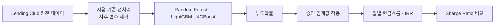

# Lending Club 대출 투자 전략

> 부도 예측을 대출 승인 기준과 현금흐름에 연결해 위험조정수익률을 높이는 투자 전략을 설계한 팀 프로젝트입니다.

- 형태: 서울대학교 빅데이터 핀테크 AI 고급 전문가 과정 팀 프로젝트
- 담당 범위: 데이터 전처리, Random Forest·LightGBM 모델 구현과 반복 실험
- 기술: Python, pandas, scikit-learn, Random Forest, LightGBM, XGBoost, IRR, Sharpe Ratio
- 원본 저장소: [Lending-Club-Project](https://github.com/SNU-Bigdata-Fintech-AI/Lending-Club-Project)

## 문제와 목표

대출 부도 모델의 분류 정확도가 높더라도 실제 투자 성과가 좋아진다고 단정할 수 없습니다. 어떤 대출을 승인할지 결정하는 임계값과 승인된 포트폴리오의 현금흐름을 함께 고려해야 합니다.

팀은 부도확률 예측, 승인 임계값 탐색, 대출별 IRR 계산을 연결해 Sharpe Ratio를 직접 비교했습니다.

## 분석 흐름

## 직접 기여

대출 상태를 기준으로 분석 대상을 정리하고 심사 시점 이후에 확인되는 변수를 제외하는 데이터 전처리에 참여했습니다. 결측치 처리와 범주형 인코딩을 거쳐 모델 입력 데이터를 구성한 뒤, Random Forest와 LightGBM을 구현하고 트리 수와 모델 설정을 바꾼 반복 실험을 수행했습니다. 학습 결과가 포함된 노트북을 정리해 다른 팀 모델과 동일한 투자 성과 기준으로 비교할 수 있도록 했습니다.

## 핵심 기술 결정

아래는 팀 전체가 사용한 투자 성과 평가 설계이며, 제 직접 담당 범위는 데이터 전처리와 Random Forest·LightGBM 모델 구현 및 반복 실험입니다.

분류 성능만으로 투자 모델을 고르지 않고 예측 부도확률을 승인 정책으로 변환한 뒤, 승인된 대출의 월별 현금흐름과 IRR을 계산해 Sharpe Ratio로 비교했습니다. 거절한 대출의 자금은 동일 기간의 미국 국채에 투자한 것으로 가정해 승인 규모가 다른 전략을 같은 기준에서 평가했습니다.

또한 대출 심사 시점 이후에 알 수 있는 상환 결과와 추심 관련 변수를 제거해 데이터 누수를 줄였습니다. 예측력이 아니라 실제 투자 시점에 사용할 수 있는 정보만으로 전략을 평가하는 데 초점을 맞췄습니다.

## 결과와 검증

- 2007–2020년 Lending Club 약 175만 건을 학습·검증 데이터와 별도 hold-out test로 나눴습니다.
- 심사 시점에 알 수 없는 사후 변수를 제외해 데이터 누수를 줄였습니다.
- 예측 부도확률이 임계값 이하인 대출만 승인하고 현금흐름 기반 IRR을 계산했습니다.
- 세 모델 모두 약 0.15의 승인 임계값에서 높은 성과를 보였고, 별도 테스트 실험에서 XGBoost가 약 0.116의 Sharpe Ratio를 기록했습니다.

대표 수치는 팀 전체 파이프라인의 결과이며, 제 직접 담당 범위는 데이터 전처리와 Random Forest·LightGBM 실험입니다.

## 제약과 개선 방향

- 조기상환과 실제 듀레이션을 더 정확하게 반영해야 무위험수익률과 Sharpe Ratio 계산의 타당성이 높아집니다.
- 승인 임계값은 분류 지표가 아니라 실제 투자 목적함수와 손실 허용 범위에 맞춰 검증해야 합니다.
- 후속 실험에서는 시기별 경기 변화와 데이터 분포 이동을 반영해 임계값과 위험조정수익률의 안정성을 검증할 필요가 있습니다.

## 관련 자료

- [데이터 전처리 노트북](https://github.com/SNU-Bigdata-Fintech-AI/Lending-Club-Project/blob/main/data/data_preprocessing.ipynb)
- [Random Forest 실험 노트북](https://github.com/SNU-Bigdata-Fintech-AI/Lending-Club-Project/blob/main/notebooks/rf/model_rf_v2%28tree100%29_with_result.ipynb)
- [LightGBM 실험 노트북](https://github.com/SNU-Bigdata-Fintech-AI/Lending-Club-Project/blob/main/notebooks/lgbm/model_lgbm_with_result.ipynb)

[포트폴리오로 돌아가기](../README.md)
